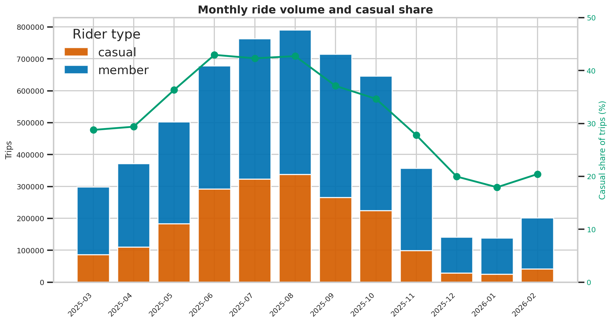
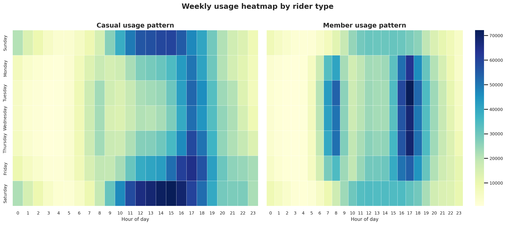

# Bike-Share Rider Behavior Analysis

Professional data analysis project using public Divvy bike-share trip data from Chicago.

The analysis answers a practical business question:

**How do annual members and casual riders use bike-share trips differently, and how can those differences inform membership conversion strategy?**

The project uses 12 months of trip data, applies reproducible Python cleaning and validation, and presents findings in executed Jupyter notebooks with inline charts.

## Business Problem

Bike-share operators often depend on annual members for recurring revenue, while casual riders represent a large pool of potential members. The goal of this project is to compare how these two rider groups behave and identify where membership conversion campaigns are most likely to be relevant.

The analysis supports decisions about campaign timing, location targeting, and message positioning for converting casual riders into annual members.

## Data Sources

- Public trip data: Divvy system data from March 2025 through February 2026
- Raw file location: `data/raw/`
- Official data page: https://divvybikes.com/system-data
- Data license: https://divvybikes.com/data-license-agreement

The raw ZIP files are not intended to be committed because they are large. Use `scripts/download_divvy_data.py` to recreate the local raw data folder.

## Tools

- Python
- pandas
- matplotlib
- seaborn
- Jupyter
- pathlib

## Repository Structure

```text
.
├── README.md
├── data/
│   ├── README.md
│   ├── raw/
│   └── processed/
├── notebooks/
│   ├── 01_business_understanding.ipynb
│   ├── 02_data_cleaning.ipynb
│   ├── 03_exploratory_analysis.ipynb
│   └── 04_final_recommendations.ipynb
├── notes/
│   ├── assumptions.md
│   ├── business_task.md
│   └── data_quality_notes.md
├── reports/
│   ├── final_summary.md
│   ├── figures/
│   └── tables/
├── scripts/
│   ├── analyze_bikeshare.py
│   ├── clean_data.py
│   ├── create_summary_tables.py
│   ├── bikeshare_analysis.py
│   ├── download_divvy_data.py
│   └── validate_data.py
├── main.tex
├── requirements.txt
└── .gitignore
```

## Notebook Workflow

The notebooks are the primary portfolio artifacts:

1. `01_business_understanding.ipynb`: frames the business question, target audience, decision supported, and data scope.
2. `02_data_cleaning.ipynb`: runs the cleaning pipeline, reports row counts, and displays data-quality outputs.
3. `03_exploratory_analysis.ipynb`: regenerates report tables and figures, with all charts displayed inline.
4. `04_final_recommendations.ipynb`: converts the EDA into evidence-based recommendations and writes `reports/final_summary.md`.

Shared logic lives in `scripts/bikeshare_analysis.py` so notebooks and terminal scripts use the same cleaning rules, summary tables, chart functions, and validation checks.

## Methodology

1. Downloaded 12 monthly Divvy trip data ZIP files.
2. Read raw CSV files in chunks to handle the full year without loading all records into memory.
3. Parsed timestamps, validated rider categories, and created analysis fields such as ride length, month, weekday, hour, weekend flag, commute-window flag, and round-trip flag.
4. Removed duplicate ride IDs, invalid dates, nonpositive durations, rides outside the analysis window, and rides longer than 24 hours.
5. Preserved records with missing station names for time-based analysis, but excluded blank station names from station rankings.
6. Generated processed summary tables, report-ready tables, charts, executed notebooks, and a final written summary.
7. Ran validation checks against raw files, processed outputs, and report assets.

## Key Findings

- The cleaned analysis contains 5,595,842 valid rides from 5,601,662 raw rows.
- Members account for 64.1% of valid rides; casual riders account for 35.9%.
- Casual rides are longer on average: 19.13 minutes versus 12.01 minutes for members.
- Casual use is more weekend-oriented, while member use is more commute-oriented on weekdays.
- Casual rider share and volume are strongest in the warmer months.
- Top casual start stations are concentrated around lakefront, park, and visitor-oriented locations such as DuSable Lake Shore Dr & Monroe St, Navy Pier, and Streeter Dr & Grand Ave.

## Visualizations





Additional figures are available in `reports/figures/` and are displayed inline in `notebooks/03_exploratory_analysis.ipynb`.

## Recommendations

1. Launch seasonal conversion campaigns during the summer casual-riding window.
2. Focus location-based messaging around the highest casual start stations.
3. Position membership around repeated weekend and leisure convenience, not only commuting.

Each recommendation is detailed in [`reports/final_summary.md`](reports/final_summary.md), with the supporting insight, expected impact, and caveat.

## Limitations

- Public trip data is anonymized, so trips cannot be connected to individual riders over time.
- The dataset does not include demographics, income, pricing plan history, marketing exposure, or conversion outcomes.
- Some valid rides have missing station names, limiting station-level analysis.
- Recommendations are directional and should be validated with campaign tests, customer research, or internal conversion data before major investment.

## Reproduce the Project

Create and activate a virtual environment:

```bash
python -m venv .venv
source .venv/bin/activate
python -m pip install --upgrade pip
python -m pip install -r requirements.txt
```

Download the raw Divvy data:

```bash
python scripts/download_divvy_data.py
```

Run the complete script pipeline:

```bash
python scripts/analyze_bikeshare.py
```

Execute the notebooks in order:

```bash
python -m nbconvert --to notebook --execute --inplace notebooks/01_business_understanding.ipynb
python -m nbconvert --to notebook --execute --inplace notebooks/02_data_cleaning.ipynb
python -m nbconvert --to notebook --execute --inplace notebooks/03_exploratory_analysis.ipynb
python -m nbconvert --to notebook --execute --inplace notebooks/04_final_recommendations.ipynb
```

Run individual terminal steps if needed:

```bash
python scripts/clean_data.py
python scripts/create_summary_tables.py
python scripts/validate_data.py
```

The pipeline writes processed data to `data/processed/`, report tables to `reports/tables/`, figures to `reports/figures/`, and the final summary to `reports/final_summary.md`.
